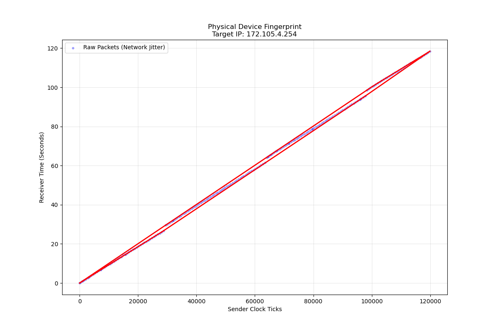

# Chronos-Track: Active Physical Device Fingerprinting (PoC)


Chronos-Track is a Rust-based active reconnaissance engine that fingerprints remote hardware by measuring microscopic clock skew leaked through TCP timestamps. By driving its own Layer-3 injector, suppressing operating-system interference, and post-processing the captured timing signatures with Convex Hull analysis, the tool can distinguish real physical quartz oscillators from VPN exits, Tor relays, and honeypots.

## Executive Summary
Modern defenses rely on virtualized infrastructure, yet the quartz crystal oscillators on physical hosts still leak uniquely identifiable skew at parts-per-million resolution. Chronos-Track automates the entire attack chain: it weaponizes raw sockets to emit calibrated SYN trains, manipulates iptables to silence kernel RST storms, captures nanosecond-precision RX timestamps, and builds a lower convex hull to expose the true oscillator drift. The result is a practical deanonymization workflow for advanced operators and hardware attribution research.

## Proof of Concept (The Graph)


*Figure 1: 120-second active scan of a remote server. The linear red convex hull reveals the stable physical crystal oscillator drift, proving it is a physical device and not a virtual honeypot.*

## Architecture Overview
- **Injector** – Crafts raw IPv4/TCP SYN frames (with timestamp options) via Layer-3 sockets, fixes checksums (WSL2 safe), and continuously excites the remote clock.
- **RstGuard** – Dynamically inserts/removes iptables rules to drop local RSTs, ensuring the kernel does not collapse the half-open probes.
- **Sniffer** – Listens on AF_PACKET sockets with `SO_TIMESTAMPING`, extracts TCP timestamp options, and correlates them with nanosecond kernel receive times.
- **Analysis Pipeline** – Streams measurements to CSV for Python-based convex hull filtering, isolating the lower envelope that represents true hardware drift.

## Key Capabilities
- **Active Hunter Mode** – Fully autonomous injector; no curl/nmap dependency. Just provide an interface and target IP.
- **Kernel Bypass & Firewall Manipulation** – Applies iptables suppression to eliminate the OS “RST storm,” keeping the handshake in a controlled half-open state.
- **WSL2 Optimization** – Compatible with Windows Subsystem for Linux; includes checksum recalculation and guidance for disabling NIC offload via `ethtool`.
- **Convex Hull Analysis Engine** – Exports `measurements.csv` for Python notebooks that compute the monotone-chain hull and ppm skew for long-term drift measurements.

## Installation & Usage
### Prerequisites
- Linux or WSL2 with CAP_NET_RAW (root recommended)
- `iptables`, `ethtool`, `python3` + `numpy`/`matplotlib` (for analysis scripts)
- Disable TX/RX checksum offload if running inside virtualized adapters: `sudo ethtool -K eth0 tx off rx off`

### Build
```bash
cargo build --release
```

### Run (Active Hunter Mode)
```bash
RUST_LOG=debug sudo -E ./target/release/chronos_track \
    --interface eth0 \
    --target-ip 203.0.113.42
```

### Output
- `measurements.csv` – raw tuples `(kernel_rx_time_ns, tcp_tsval, src_ip)` for each accepted packet
- `graphs/*.png` – optional Python pipeline output showing convex hulls & ppm estimates

## Disclaimer
This project is provided for educational and authorized security research only. Operating Chronos-Track against systems without explicit permission may violate laws and agreements. The authors and contributors assume no liability for misuse.
