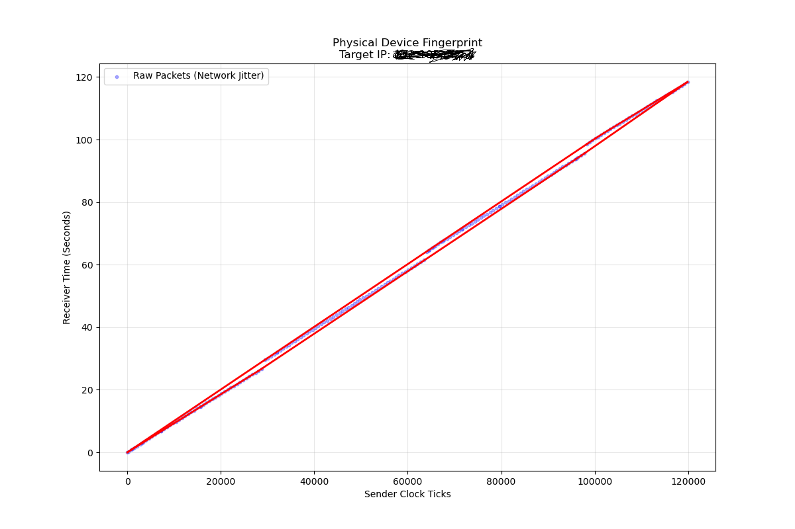

# 🕰️ Chronos-Track
### Active Remote Physical Device Fingerprinting Engine


> **"Hardware never lies."**

**Chronos-Track** measures clock skew by examining microscopic drift in TCP timestamps. The engine injects SYN probes with mandatory TSopt fields, captures the replies with nanosecond kernel timestamps, and runs lower-convex-hull regression to separate physical quartz signatures from virtualized honeypots.

---

## ⚡ Key Capabilities (v1.2)

| Feature | Description |
| :--- | :--- |
| **Active Hunter Mode** | Layer-3 injector crafts IPv4 SYN packets with TSopt and refreshes the spoofed source IP every loop. |
| **👻 Stealth Jitter** | Adaptive transmit cadence (10–500 ms) with random jitter to break IDS/IPS timing patterns. |
| **🧠 Math Core** | Convex-hull lower bound plus linear regression that rejects noisy points and emits ppm, slope, and $R^2$. |
| **🛡️ RstGuard** | Automatically inserts/removes `iptables` OUTPUT rules to drop local RST packets (source port 54321). |
| **📺 Live TUI** | Ratatui dashboard with session stats, scatter plot + regression line, and the “🧠 CHRONOS INTELLIGENCE” panel. |
| **📦 Data Export** | Continuous CSV logging (`measurements.csv`) and a Python helper (`plot.py`) for convex-hull charts.

### Why This Matters

- **Hardware truthing:** Physical clock skew survives VPNs/NAT, allowing real bare metal to be separated from staged decoys.
- **Noise rejection:** SO_TIMESTAMPING + hull filtering reduce path jitter, so congested links are still analyzable.
- **Instant intel:** Live verdict stream provides immediate go/no-go signals, while raw data stays available for offline work.

---

## 🔬 Theory of Operation

Every quartz oscillator deviates from $f_{nominal}$. Chronos-Track measures the slope between the target clock $T_{ts}$ and the local clock $t_{rx}$:

$$\alpha = \frac{f_{actual} - f_{nominal}}{f_{nominal}}$$

- **Physical Hardware:** Displays linear drift with high $R^2$ (≥ 0.99).
- **Virtual / Honeypot:** Shows zero slopes, steps, or chaotic noise caused by hypervisor synchronization.

### Data Products

- `measurements.csv` – One row per packet: `kernel_time_ns,sender_ts_val,src_ip`.
- `graphs/fingerprint_*.png` – Produced via `python plot.py`, combining scatter points and the hull outline.
- Exit report – Triggered on `Ctrl+C`, prints samples collected, slope, ppm, $R^2$, verdict, and narrative summary.

---

## 🛠️ System Architecture

```mermaid
graph TD;
    A[Injector Tx] -->|Raw SYN + TSopt| B(Target Host);
    B -->|SYN-ACK + TSval| C[Sniffer Rx];
    C -->|SO_TIMESTAMPING| D{Analysis Core};
    D -->|Observations| E[Convex Hull Regression];
    E -->|ppm, R², Verdict| F[TUI + CSV];
````

### Pipeline Overview

1. **Injector** – PNET layer-3 channel builds IPv4/TCP + timestamp option (fixed TSval) and adds jitter.
2. **RstGuard** – Installs an `iptables OUTPUT` rule to suppress local `RST` packets and removes it via Drop.
3. **Sniffer** – `AF_PACKET/SO_TIMESTAMPING` socket with `recvmsg` and CMSG parsing for nanosecond precision.
4. **Analysis** – Creates `Observation` structs, computes the lower hull, infers slope→ppm→verdict and interpretation.
5. **UI & Logging** – Ratatui + `env_logger`; every 50 samples a new report is logged and painted on screen.

---

## 📊 Proof of Concept

> **Figure 1:** The red convex hull traces the linear drift of a physical target above the raw jitter cloud.

---

## 🚀 Usage

### Prerequisites

- Linux (native or WSL2) with `AF_PACKET` and `SO_TIMESTAMPING`.
- `CAP_NET_RAW` privileges and access to `iptables`.
- Optional but useful: `ethtool -K <iface> tx off rx off` to disable checksum offload during tests.

### Build

```bash
cargo build --release
```

### CLI Flags

| Flag | Required | Description |
| :--- | :--- | :--- |
| `--interface <IFACE>` | ✅ | Interface bound to the AF_PACKET socket (capture + injection). |
| `--target-ip <IPv4>` | ✅ | Active target. IPv6 is currently rejected for injection (sniffer can still see it). |
| `--target-port <u16>` | ❌ | Destination TCP port for SYN packets (default 80). |

> Run as root or grant capabilities: `setcap cap_net_raw+ep target/release/chronos_track`.

### Run

```bash
RUST_LOG=info sudo -E ./target/release/chronos_track \
    --interface eth0 \
    --target-ip 203.0.113.42 \
    --target-port 443
```

### Runtime Controls

- `Ctrl+C` – Stops injector/sniffer, closes the TUI, and prints the exit report.
- `q` / `Q` – Gracefully quits the TUI (also flips the shared `running` flag).
- INFO logs every 50 samples include point count, slope, ppm, $R^2$, verdict, and the new injection interval.

### Outputs

```text
=== Chronos-Track Exit Report ===
Samples captured: 312
Slope: 0.999873219
Clock Skew: -126.8 ppm
R²: 0.9987
Classification: Stable Physical Quartz Signature
--- 🧠 CHRONOS INTELLIGENCE ---
Signal Quality: Stable (Typical Physical Device)
Hardware Est.:  Consumer Hardware (PC/Laptop)
FINAL VERDICT:  Likely a consumer workstation or laptop behind NAT.
--------------------------------
```

To render an offline chart:

```bash
python plot.py  # creates graphs/fingerprint_<ip>_<timestamp>.png
```

---

## 🔧 Limitations & Notes

- Injector currently supports IPv4 only; passive sniffing can still observe IPv6 if packets arrive.
- `measurements.csv` is overwritten on each run—archive it before starting another session.
- Injector loop runs until the shared `running` flag is cleared; there is no separate CLI toggle yet.
- Requires `iptables` to be available (WSL users must run inside the distro that owns the interface).

---

## 🗺️ Roadmap to v2.0 (Mass Scanner)

- [x] v1.2 – Active single target + Ratatui + Convex Hull Math Core.
- [ ] v2.0 – Tokio-based async engine, concurrent target tracking, DashMap state, JSON streaming output.

📄 **Architecture v2 draft** – work in progress (internal doc).

---

## 🤝 Contributing

Pull requests welcome for:

- Additional timestamp families (QUIC, ICMP).
- Dashboards / notebooks for deeper analytics.
- Hardening profiles (AppArmor/SELinux, container policies, Windows WFP rules).

Open an issue before large refactors so we can coordinate roadmaps.

## ⚠️ Disclaimer

Use this tool only for defensive research, Red/Blue exercises, and infrastructure you own or have explicit authorization to test. Unauthorized scanning is illegal and the authors assume no liability.

```
```